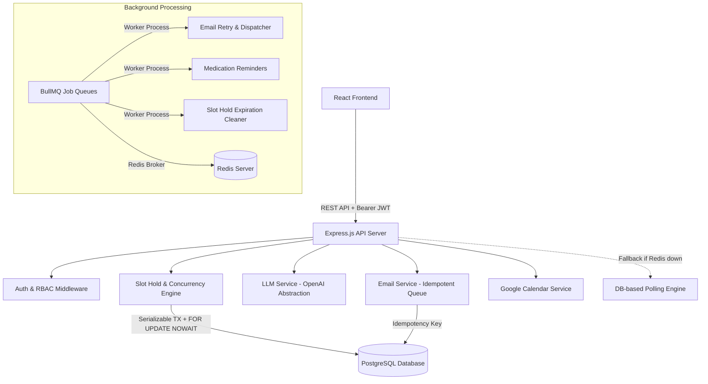
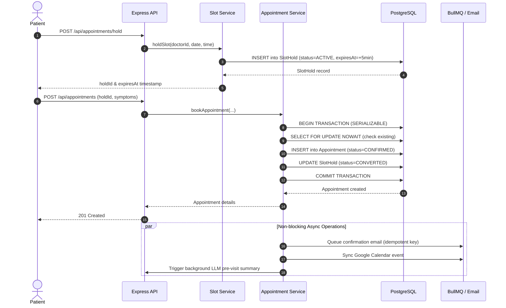
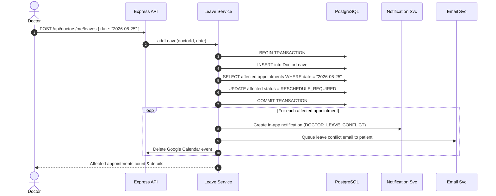

# System Architecture & Technical Specifications

This document describes the design decisions, component interactions, database locking strategies, and concurrency mechanisms of the Healthcare Appointment & Follow-up Manager.

---

## 1. System Architecture Diagram



---

## 2. Double-Booking Prevention Strategy (3-Layer Security)

Double-booking is physically impossible in this platform due to three layered mechanisms:

```
[User Action: Book Slot]
       │
       ▼
┌─────────────────────────────────────────────────────────────┐
│ LAYER 1: Slot Hold Reservation                              │
│ • Patient holds slot for 5 mins (SlotHold record)           │
│ • Checked before transaction entry                          │
└──────────────────────────────┬──────────────────────────────┘
                               │
                               ▼
┌─────────────────────────────────────────────────────────────┐
│ LAYER 2: Row-Level Locking (Pessimistic)                     │
│ • BEGIN TRANSACTION (Isolation: SERIALIZABLE)               │
│ • SELECT ... FOR UPDATE NOWAIT on existing appointments     │
│ • Immediate 409 error if locked by concurrent transaction   │
└──────────────────────────────┬──────────────────────────────┘
                               │
                               ▼
┌─────────────────────────────────────────────────────────────┐
│ LAYER 3: DB-Level Unique Constraint (Hard Invariant)        │
│ • @@unique([doctorId, appointmentDate, startTime])          │
│ • Enforced atomically at PostgreSQL storage engine layer    │
│ • Error code P2002 mapped to SLOT_ALREADY_BOOKED (409)      │
└─────────────────────────────────────────────────────────────┘
```

---

## 3. Booking Sequence Diagram



---

## 4. Doctor Leave & Conflict Resolution Workflow



---

## 5. Security & RBAC Matrix

| Endpoint | PATIENT | DOCTOR | ADMIN | Unauthenticated |
|---|:---:|:---:|:---:|:---:|
| `POST /api/auth/register` | ✅ | ✅ | ✅ | ✅ |
| `POST /api/auth/login` | ✅ | ✅ | ✅ | ✅ |
| `GET /api/doctors` | ✅ | ✅ | ✅ | ✅ |
| `POST /api/appointments/hold` | ✅ | ❌ | ❌ | ❌ |
| `POST /api/appointments` | ✅ | ❌ | ❌ | ❌ |
| `GET /api/appointments/me` | ✅ | ❌ | ❌ | ❌ |
| `POST /api/appointments/:id/symptoms` | ✅ | ❌ | ❌ | ❌ |
| `POST /api/appointments/:id/consultation` | ❌ | ✅ | ❌ | ❌ |
| `POST /api/doctors/me/leaves` | ❌ | ✅ | ❌ | ❌ |
| `GET /api/admin/*` | ❌ | ❌ | ✅ | ❌ |
